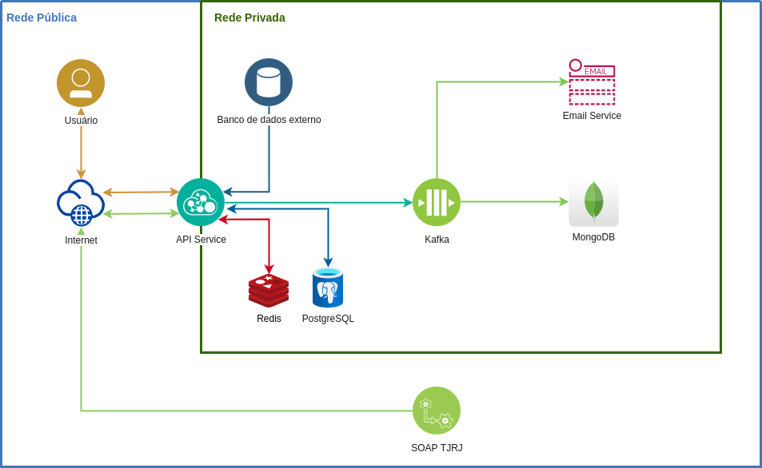

# MPRJ - Leonardo Machado

Desafio realizado para Dev. Backend Sênior MPRJ.
As orientações e perguntas podem ser encontradas [aqui.](docs/)

## Arquitetura

## Respostas e comentários
##### 1) O *endpoint* do serviço deverá receber um parâmetro inteiro positivo id, correspondente ao número de um documento.
Rota para receber id criada em app/desafio/urls.py.

Formato da rota: [http://ip:port/api/documento/id]()

**Regra 1**: A id precisa ser um inteiro positivo maior que zero (o banco geralmente começa a indexação no número 1). 
Caso o valor inserido seja invalido, o usuário recebe um erro com detalhamento do que houve e o *status code* **422** - *Unprocessable Entity*.

**Regra 2**: O usuário precisa estar autenticado pela rota [http://ip:port/api/token](). Se não estiver autenticado receberá *status code* **401** - *Unauthorized*.

**Regra 3**: Além de estar autenticado, o usuário precisa ter permissão para acessar esta rota. Caso o usuário não tenha permissão, a resposta será *status code* **403** - *Forbidden*.

Caso todos os critérios sejam satisfeitos, a resposta será *status code* **200** - *OK* e os dados das tramitações.

##### 2) Uma consulta deverá ser feita utilizando id, em um banco relacional externo, obtendo um conjunto de dados relativos a esse documento, dados_documento. Caso necessário, considere que esse banco é acessível pela rede interna, com um HOST, PORT, USER e PASSWORD já definidos. Não se preocupe com o formato dos dados no banco ou outras questões de implementação da consulta.
Na arquitetura o banco externo foi modelado fazendo parte da rede privada, ou seja, as aplicações dentro desta rede conseguirão acessar seus dados. Para esse projeto utilizei injeção de dependências, então onde o banco externo aparece, foi feito um *mock* (**MockExternalDatabaseService**) para retornar dados *hardcoded*.

##### 3) Dentro de dados_documento, há uma coluna com um número id_tjrj, que deverá ser utilizado para chamar um serviço SOAP externo, disponibilizado pelo TJRJ. Este serviço fornece um objeto XML com a tramitação do documento desejado tramitacao_documento. Essa informação, tramitacao_documento, será enviada como resposta do nosso endpoint. Caso ache relevante considerar no seu projeto, considere que possuimos um ACCESS_TOKEN, utilizado para acessar esse serviço SOAP.
O SOAP do TJRJ também foi mockado dentro da aplicação e representado por **MockTJRJSOAPService**. A classe TJRJService não leva em conta de onde vem a informação, só sabe que de algum lugar ela será consumida, então como o ACCESS_TOKEN é algo particular ao SOAP do TJRJ, o mesmo é injetado diretamente pelo *container* e somente o MockTJRJSOAPService tem acesso a ele. O ACCESS_TOKEN é configurado através do .env, pois por ser um dado sensível fica fora do versionamento.

##### 4) Outra necessidade, é que um log do serviço deverá ser guardado, com informações diversas sobre: o request realizado; o usuário que o realizou; assim como os resultados obtidos do TJRJ. Considere que o serviço do TJRJ pode sofrer alterações no futuro (por exemplo, a resposta XML pode ser extendida no futuro e vir com um número maior de informações), de forma que o formato dos dados no log pode mudar, dependendo da forma que escolher estruturar esse log.
Tendo analisado o caso de uso, o log não serão simplesmente os dados do *request* que tem um tamanho previsível e sim um tamanho variável sendo o componente de maior peso o tamanho do documento que vem como resposta do serviço do TJRJ. Armazenagem local dificultaria a escalabilidade horizontal e dificultaria o acesso a informação. O exemplo apresentado é pequeno, mas acredito que seja por simplicidade.  Na prática os documentos seriam bem maiores. Olhando pela parte negocial, é preciso levar em conta os requisitos de segurança, escalabilidade e possibilidade de auditorias.
Cheguei a conclusão de que o log seria estruturado somando os dados do request, usuário e documento de tramitação e enviado para o Kafka de forma que as tecnologias e estratégias utilizadas para armazenamento do log ficam independentes do serviço desenvolvido.

**IMPORTANTE:** A estratégia abordada para o Kafka foi a de **Fire-and-forget**, ou seja, o log é enviado para o Kafka e a execução do programa continua. Foi adotado disponibilidade máxima na API ignorando outros serviços que possam estar *offline*. Esse comportamento pode não ser desejado pela necessidade do negócio de ter logs de todas as operações. Adotei essa estratégia para dar continuidade a atividade.

##### 5) Suponha que, ao fazer um request para esse endpoint, seja guardado um par (usuário, id_tjrj). De tempos em tempos, a nossa aplicação deverá consultar o serviço SOAP do TJRJ para verificar possíveis mudanças ocorridas na tramitação do documento associado, desde a última consulta. Caso tenha havido mudanças, o nosso serviço deverá disparar o envio de um email para o usuário, de forma assíncrona, alertando-o que houve mudanças no documento. OBS: Não se sinta preso(a) ao Django! Caso julgue que essa tarefa é melhor realizada utilizando outras tecnologias em conjunto para sub-tarefas específicas, explicite isso no seu projeto!
Quando o usuário faz uma requisição, além do par usuário e id_tjrj, também salvar um *hash* dos dados recebidos do TJRJ. 
Após o usuário fazer uma consulta síncrona, o sistema salva um *hash* da resposta do SOAP do TJRJ e inscreve o usuário que pesquisou numa lista de observadores. De tempos em tempos um cron job fará acesso aos documentos pesquisados antes de forma síncrona. Essa ação ocorre de forma assíncrona e após fazer a consulta ao TJRJ, faz o hash do resultado e verifica se é igual ao que tinha no último acesso síncrono. Se o hash for igual é porque o documento não teve alteração desde o último acesso de um usuário. Caso os hashs sejam diferentes, então remover o *cache* atual do documento e comunicar aos usuários que estão na lista de observadores que o documento foi atualizado. Ao encontrar uma mudança, a aplicação publica no Kafka um evento para disparo de e-mail, sendo da responsabilidade de um microservice o disparo do e-mail para o usuário. Dessa forma podemos centralizar as técnicas para lidar com erros, retentativas e lógicas de envio de e-mail em um único lugar.

##### 6) O nosso endpoint acessa dados sensíveis! Assim, ele não pode estar aberto para todas as pessoas que conheçam sua URL. Apenas usuários autorizados devem conseguir utilizá-lo. Pense numa abordagem de autenticação e/ou autorização que satisfaça esse requisito do serviço. Não esqueça de dizer por que escolheu essa abordagem!
A autenticação pode ser feita por JWT. Na modelagem atual a API está sem estado, então o JWT reforça a abordagem atual permitindo facilmente a distribuição de chamadas a outras instâncias da API de forma transparente para o usuário sem a necessidade de técnicas de redirecionamento baseado em sessão. O Django REST Framework fornece a opção de verificar autorizações de forma customizada fazendo override da BasePermission utilizando as permissões do próprio DJango de forma extremamente simples e fácil. Um usuário só poderá acessar a rota para consultar o documento se ele estiver autenticado e tiver a permissão view_document.

##### 7) Ao analisar o serviço em produção, você nota que a maioria dos requests são feitos para um conjunto pequeno de ids. Nos últimos 7 dias, 80% dos requests, por exemplo, são feitos para o documento com parâmetro id=1000. Ao indagar a área de negócios, você descobre que esse comportamento é normal, com um ou mais documentos recebendo muita atenção de tempos em tempos - hoje é o caso do id=1000, mas semana que vem poderia ser o id=1500. Com essa informação em mãos, você faria alguma modificação no serviço e/ou nas tecnologias utilizadas para o deploy de forma a otimizá-lo? Por quê?
Sim. Faria uma modificação no serviço e incluiria mais uma tecnologia no deploy. A otimização realizada seria fazer *cache* do resultado obtido na consulta utilizando o [redis](!https://redis.io/). Existem diversas razões para se fazer cache. Não foram informadas limitações quanto ao número de requests ao SOAP do TJRJ, então a única razão levada em conta é o fato da consulta ser em XML, que é verboso por natureza e o documento pode ser bem maior do que o apresentado no exemplo, então fazer essa consulta à um servidor externo tem um custo, ao passo que retorná-la direto da memória do nosso *endpoint* exige bem menos recursos.

O *cache* foi pensado da seguinte maneira:
Ao usuário fazer uma requisição, verificar se existe o resultado no cache, se existir, retorna imediatamente o resultado.
Caso não exista, faça a requisição e salve o resultado da requisição no cache.

O cache evita o acesso ao banco externo e ao TJRJ, então nossa aplicação vai ser mais eficiente.

Obs.: o *cache* tem um ciclo de vida de 10 minutos (configurado via .env), porém caso a *async request* ache uma versão mais nova no *endpoint* do TJRJ, o *cache* é invalidado imediatamente e o usuário é notificado via e-mail.

##### 8) Por último: suponha que o "Fulano de Tal" esteja sendo investigado pelo MP. Uma demanda foi feita para implementarmos uma funcionalidade que busque, utilizando o log do nosso serviço, os usuários que tiveram acesso a informações de tramitação de documentos em que o "Fulano de Tal" aparece. Considere que um colega seu começou a tarefa, e já implementou algumas funcionalidades, com base no log que você implementou. No entanto, uma das etapas inclui percorrer o log inteiro, buscando no texto completo dos documentos (ou seja, o texto do campo <doc> do XML) uma string de busca (ex.: "Fulano de Tal"), e ele pediu sua ajuda. Qual abordagem você sugeriria que seja feita para realizar esse full text search dentro dos documentos das tramitações?
Minha decisão de projeto foi guardar os logs em outro lugar através do Kafka, então a complexidade deste tipo de consulta acaba subindo também. Optei por salvar os logs no MongoDB, porém esse processo está acontecendo através do Kafka. Eu poderia consultar o MongoDB rapidamente e retornar a resposta, mas isso quebraria a lógica de ter usado o Kafka e acoplaria a API ao Mongo.

O Kafka não serve somente como mensageiro. Ele acaba se tornando um repositório central de confiança de toda a arquitetura, então se mudarmos as políticas de retenção de dados é possível fazer a requisição dos usuários seja no próprio kafka ou com um serviço extra que consuma desde o início os logs. A operação provavavelmente teria que ocorrer de forma assíncrona, então quando o usuário solicitar esse tipo de informação, o sistema retornaria imediatamente uma resposta a ele com um link onde ele poderia acessar essa informação ou notificaria por e-mail avisando que já tem resposta. a API passaria a se comportar tanto como Producer quanto Consumer.